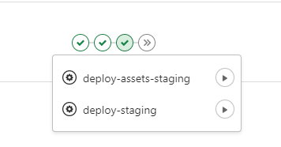

# Wartek NextJS Boilerplate

> Standard boilerplate for NextJS project.

## Setup the project

The following step will get you up and running with the project:

1. Clone this repo locally

```bash
git clone git@gitlab.com:wartek-id/boilerplate-next-js.git example-project
cd example-project
```

2. Remove .git folder and initiate new git.

```
rm -rf .git
git init
```

3. Add remote origin project

```
git remote add origin git@gitlab.com:wartek-id/example-project.git
```

4. Add [gitlab auth token](https://wartek.atlassian.net/wiki/spaces/ENG/pages/1110868482/Design+Token+Library#Web-Apps) to your env.

```bash
export GITLAB_AUTH_TOKEN=YOUR_TOKEN
```

5. Install all dependencies by running `npm install`. This command will install mandatory dependencies.

## Tooling

- UI library use [Preact](https://preactjs.com) as default.
- [Typescript](https://www.typescriptlang.org/)
- Linting with [ESLint](https://eslint.org/)
- Formatting with [Prettier](https://prettier.io/)
- Linting, typechecking and formatting on by default using [`husky`](https://github.com/typicode/husky) for commit hooks
- Testing with [Jest](https://jestjs.io/) and [`react-testing-library`](https://testing-library.com/docs/react-testing-library/intro)
- [Jest Axe](https://github.com/nickcolley/jest-axe) custom matcher for test a11y in components
- [Storybook](https://storybook.js.org) for rapid UI component development and testing

## Commands

- `npm run dev`: run development server
- `npm run dev:debug`: run development server with debug mode
- `npm run build`: run build application.
- `npm run start`: run development server with `production` environtment. Need build application first.
- `npm run test`: run test for all component or pages
- `npm run storybook`: start storybook server and loads stories in file that end with `*.stories.tsx`

## FAQ

<details>
<summary>We can't use Preact for our projects. Because of <strong>{something}</strong></summary>

We suggest use Preact first. But if your project can't use it or have problem when running using Preact, you can eject or replace Preact with React. You can

</details>

<details>
<summary>How to setup our app in environment staging/production?</summary>

You can follow this guide to deploy your app in staging/production:
[Deployment guide](https://wartek.atlassian.net/wiki/spaces/CLOUD/pages/1790050753/Guide+Deployment+from+0)

</details>

<details>
<summary>How to deploy our app to staging/production</summary>

## Staging

When your MR is merged to main branch, you can deploy your app to staging by clicking manually on the play button like this image bellow



## Production

If you want to deploy your app to production. You can run this script in your terminal:

```bash
git tag release-production-$(date +"%Y%m%d-%H%M%S") && git push --tags -v
```

</details>
# profilio
# profilio
